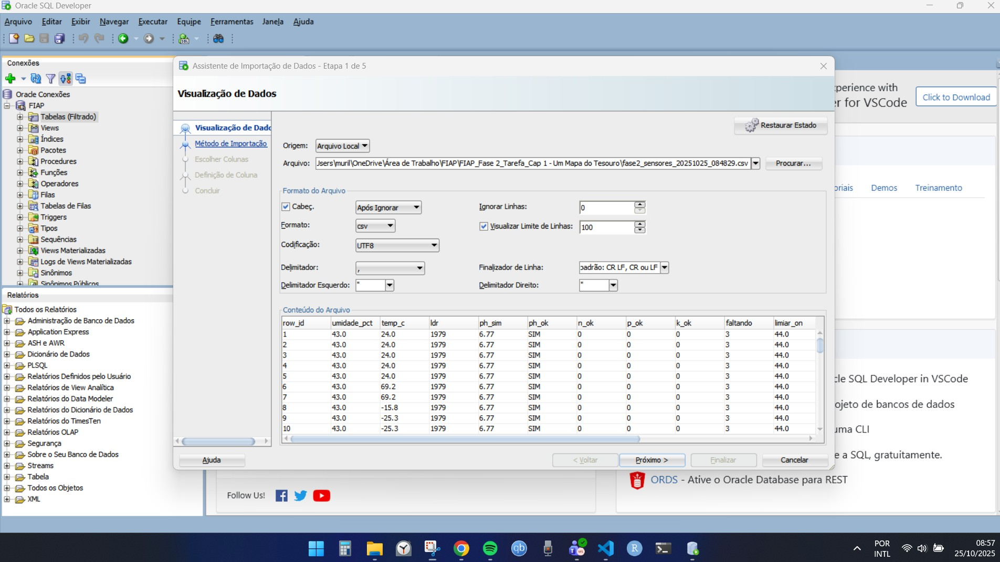
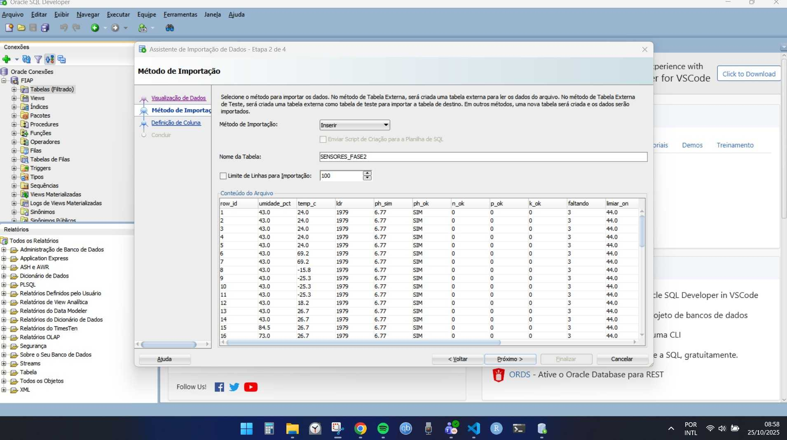
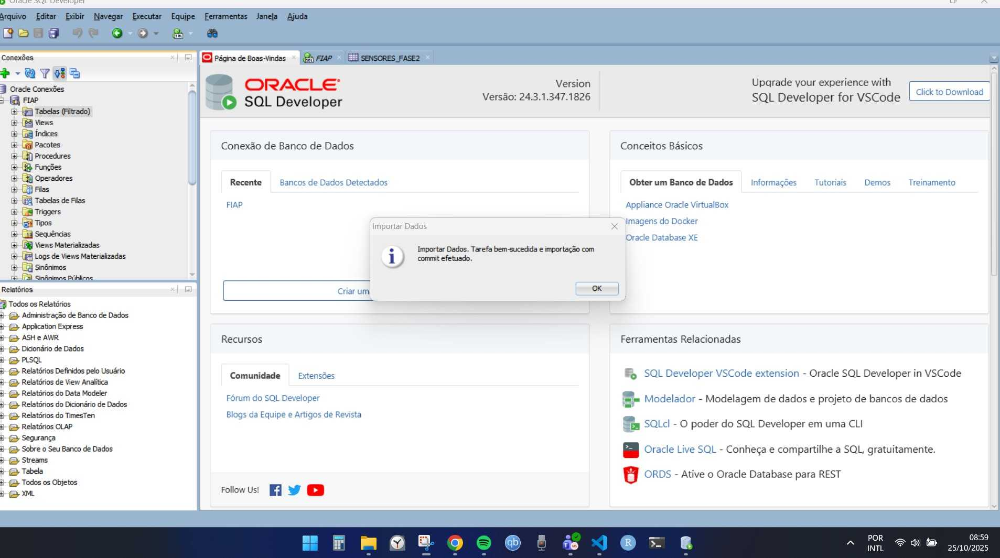
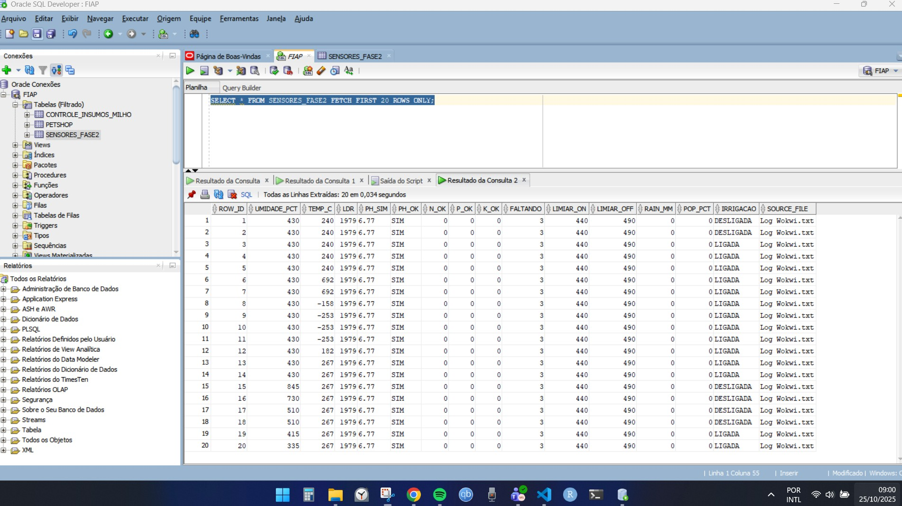
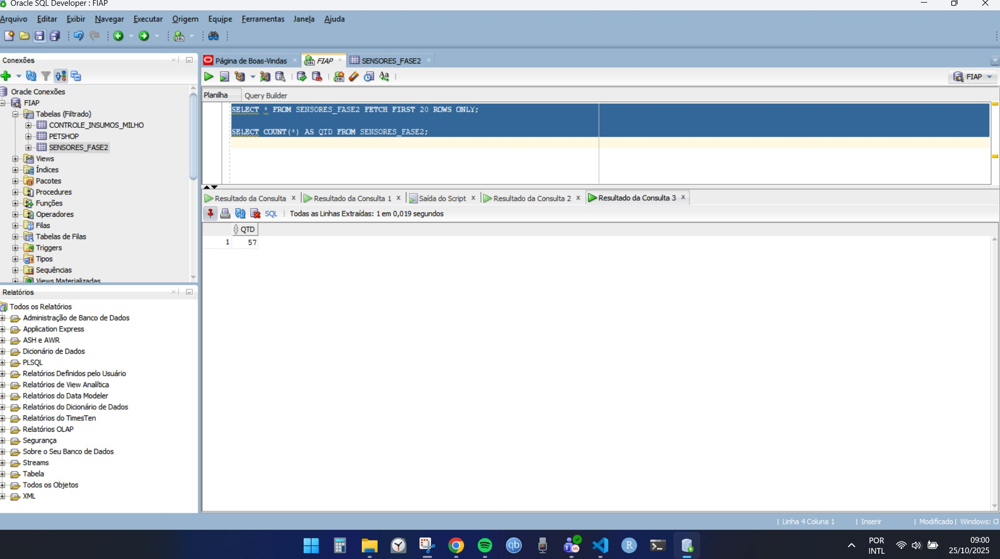
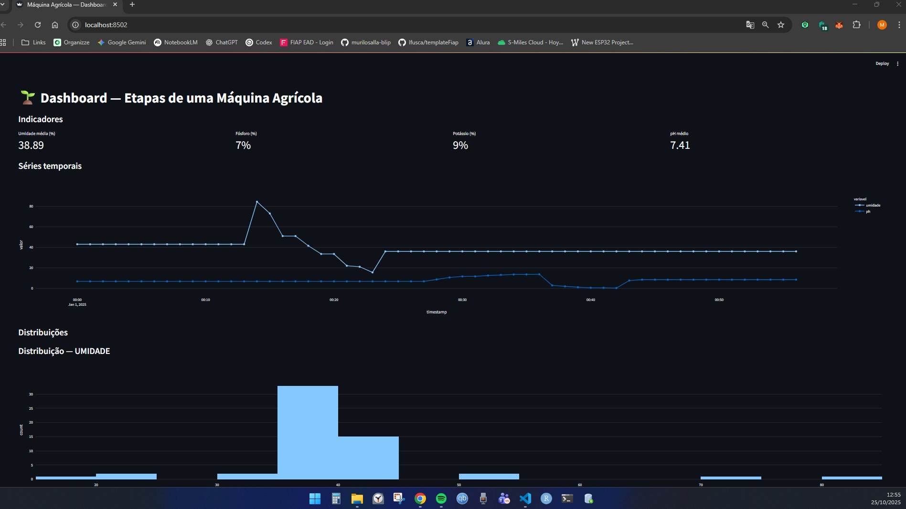

# FIAP - Faculdade de Informática e Administração Paulista

## Fase 3 - Capítulo 1

### Etapas de uma Máquina Agrícola

🎥 Vídeo demonstrativo FIAP_Fase 3_Tarefa_Cap 1 - Etapas de uma Máquina Agrícola: [Assista aqui](https://www.youtube.com/watch?v=m3aPuPz5YMA)
🎥 Vídeo demonstrativo FIAP_Fase 3_Tarefa_Cap 1 - Opção 2 – Machine Learning no Agronegócio: [Assista aqui](https://youtu.be/luf3FC099vo)

---

## 👨‍🎓 Integrantes

* Murilo Salla (RM568041)

## 👩‍🏫 Professores

* Tutor(a): Ana Cristina dos Santos
* Coordenador(a): André Godoi Chiovato

---

## 📜 Descrição

Este projeto faz parte da **Fase 3 - Colheita de Dados e Insights** do curso de Inteligência Artificial da FIAP.

Foram realizados os exercícios **obrigatórios** e os dois programas opcionais do **Ir Além**: **Dashboard em Python (Streamlit)** e **Machine Learning no Agronegócio**.

A proposta segue o PBL (Project-Based Learning) em que a startup fictícia **FarmTech Solutions** aplica soluções de Inteligência Artificial no agronegócio, uma das áreas mais promissoras do Brasil segundo o **Global AI Jobs Barometer da PwC (2025)**.

---

## 📌 Principais entregas

### ✅ Entrega obrigatória — Banco de Dados (Oracle SQL Developer)

* Conversão do log da Fase 2 em **CSV via Python**.
* Importação do arquivo **fase2_sensores.csv** diretamente no Oracle (sem `CREATE TABLE` manual).
* Consultas SQL:

```sql
SELECT * FROM FASE2_SENSORES;
SELECT COUNT(*) FROM FASE2_SENSORES;
```

#### 📸 Evidências do Oracle (prints obrigatórios)

- **Importação do CSV da Fase 2 — assistente (preview)**
  
  

- **Definição do nome da tabela (sem `CREATE TABLE` manual)**
  
  

- **Confirmação de importação bem-sucedida**
  
  

- **Consulta completa da tabela (`SELECT * FROM FASE2_SENSORES;`)**
  
  

- **Contagem de registros (`SELECT COUNT(*) FROM FASE2_SENSORES;`)**
  
  

> **Base utilizada:** `data/fase2_sensores_20251025_084829.csv` (arquivo gerado a partir da Fase 2).

### 🚀 Ir Além — Dashboard em Streamlit

Dashboard interativo em Python:

* Indicadores principais: **Umidade, Fósforo, Potássio, pH**.
* Séries temporais de **Umidade** e **pH**.
* Distribuições: histogramas de **Umidade**, **pH** e **Temperatura**.
* Sugestões automáticas de irrigação e adubação.
* Prints de tela documentados em `/assets`.

#### 📸 Evidências do Dashboard (Streamlit)

- **Home — indicadores e série temporal de umidade**
  
  

- **Distribuições / pH / Temperatura / Sugestões**
  
  

### 🤖 Ir Além — Machine Learning no Agronegócio

* **Análise Exploratória (EDA)** com 5 gráficos: histogramas, boxplots, correlação, irrigação e relação pH × umidade.
* **Perfis ideais** de solo/clima para 3 culturas (rótulos sintéticos).
* **5 modelos preditivos** treinados com diferentes algoritmos e **avaliação comparativa** (acurácia, macro-F1 etc.).
* Código e análises consolidadas em **Jupyter Notebook**: `MuriloSalla_RM568041_fase3_cap1.ipynb`.

---

## 📁 Estrutura de pastas

* `.github/`: arquivos de configuração específicos do GitHub.
* `assets/`: prints e relatórios (Oracle, Streamlit, EDA, Machine Learning).
* `config/`: arquivos de configuração e ajustes do projeto.
* `data/`: bases utilizadas (ex.: `fase2_sensores_20251025_084829.csv`).
* `document/`: documentação oficial (`documentai_project_document_fiap.md`).
* `document/other/`: documentos auxiliares.
* `scripts/`: scripts auxiliares de automação.
* `src/`: código-fonte principal (Python da Fase 3 e referência C++ da Fase 2).
* `streamlit_app.py`: dashboard principal.
* `requirements.txt`: dependências do projeto.
* `MuriloSalla_RM568041_fase3_cap1.ipynb`: notebook com Machine Learning.
* `README.md`: guia geral (este arquivo).

---

## 🔧 Como executar o projeto

### Pré-requisitos

* **Python 3.13+**
* **Oracle SQL Developer**
* Ambiente virtual configurado (`.venv`)
* Bibliotecas Python listadas em `requirements.txt`

> **Observação sobre o CSV**
> O nome do CSV pode conter data (ex.: `data/fase2_sensores_20251025_084829.csv`).
> Se preferir, crie um `.env` com uma variável para fixar o caminho:
>
> ```
> CSV_PATH=data/fase2_sensores_20251025_084829.csv
> ```
>
> O Streamlit e os scripts utilizam `CSV_PATH` se presente.

---

### 1) Banco de Dados — Oracle SQL Developer

1. Abra o **Oracle SQL Developer** e conecte-se com seu usuário **RM** e senha FIAP.
2. Use a opção **Import Data** e selecione o arquivo CSV (por exemplo):

   ```
   data/fase2_sensores_20251025_084829.csv
   ```
3. O Oracle criará automaticamente a tabela **FASE2_SENSORES** (ou o nome informado no assistente).
4. Execute as consultas:

```sql
SELECT * FROM FASE2_SENSORES;
SELECT COUNT(*) FROM FASE2_SENSORES;
```

---

### 2) Dashboard em Streamlit (IR ALÉM)

```powershell
# 2.1 Ativar venv (na raiz do projeto)
python -m venv .venv
. .\.venv\Scripts\Activate.ps1

# 2.2 Instalar dependências
pip install -r requirements.txt

# 2.3 Rodar Streamlit
python -m streamlit run streamlit_app.py
```

A dashboard abrirá em **[http://localhost:8501/](http://localhost:8501/)** (ou `8502`).

**Dica (Windows/PowerShell):** se der erro de “.venv não encontrado”, confira se está no diretório do projeto:

```powershell
pwd
ls requirements.txt, streamlit_app.py
```

---

### 3) Machine Learning no Agronegócio (IR ALÉM)

Abra o arquivo **`MuriloSalla_RM568041_fase3_cap1.ipynb`** no **VS Code** (ou Jupyter), selecione o **kernel da `.venv`** e **Execute célula por célula**.
Os artefatos são gerados automaticamente em **`/assets`**:

#### EDA (5+ gráficos)

* `eda_histogramas.png`
* `eda_boxplots.png`
* `eda_correlacao.png`
* `eda_irrigacao.png`
* `eda_ph_umidade.png`

#### Rótulos e perfis ideais

* `fase2_sensores_rotulado.csv`  ← base rotulada (milho/soja/café)
* `ml_perfis_ideais.txt`         ← faixas de umidade, temp., pH e chuva (por cultura)
* `ml_perfis_estatisticas_base.txt`
* `ml_perfis_rotulos_sinteticos.txt`

#### Comparação de modelos

* `ml_model_report.csv`              ← tabela consolidada (métricas por algoritmo)
* `ml_model_comparativo.png`         ← gráfico comparativo (macro-F1)
* `ml_model_comparativo.txt`         ← resumo textual
* `ml_best_confusion_matrix.png`     ← matriz do melhor modelo
* `ml_best_classification_report.txt`← classificação detalhada do melhor modelo

#### Relatórios por algoritmo (auditoria)

* `ml_LogisticRegression_report.txt`
* `ml_KNN_report.txt`
* `ml_RandomForest_report.txt`
* `ml_SVC_report.txt`                 ← classificador SVM (implementação SVC)
* `ml_SVM_report.txt`                 ← **opcional** (se idêntico ao SVC pode remover)
* `ml_GradientBoosting_report.txt`    ← **modelo extra** além dos 5 exigidos

---

## 🧪 Troubleshooting rápido

* **Streamlit não abre / ModuleNotFoundError**
  Ative a venv correta e instale as dependências:

  ```powershell
  . .\.venv\Scripts\Activate.ps1
  pip install -r requirements.txt
  python -m streamlit run streamlit_app.py
  ```

* **Notebook não executa / kernel errado**
  No VS Code, selecione o kernel da **.venv** (canto superior direito do `.ipynb`) e rode **Restart Kernel → Run All**.

* **CSV não encontrado**
  Ajuste o caminho no arquivo `.env`:

  ```
  CSV_PATH=data/fase2_sensores_20251025_084829.csv
  ```

---

## 🗃 Histórico de lançamentos

* **1.0.0 — 25/10/2025**

  * Importação Oracle concluída e consultas realizadas.
  * Dashboard em Streamlit implementada (sem filtros).
  * Machine Learning: EDA, perfis ideais, 5+ modelos e comparação.
  * Notebook, relatórios e vídeos adicionados.